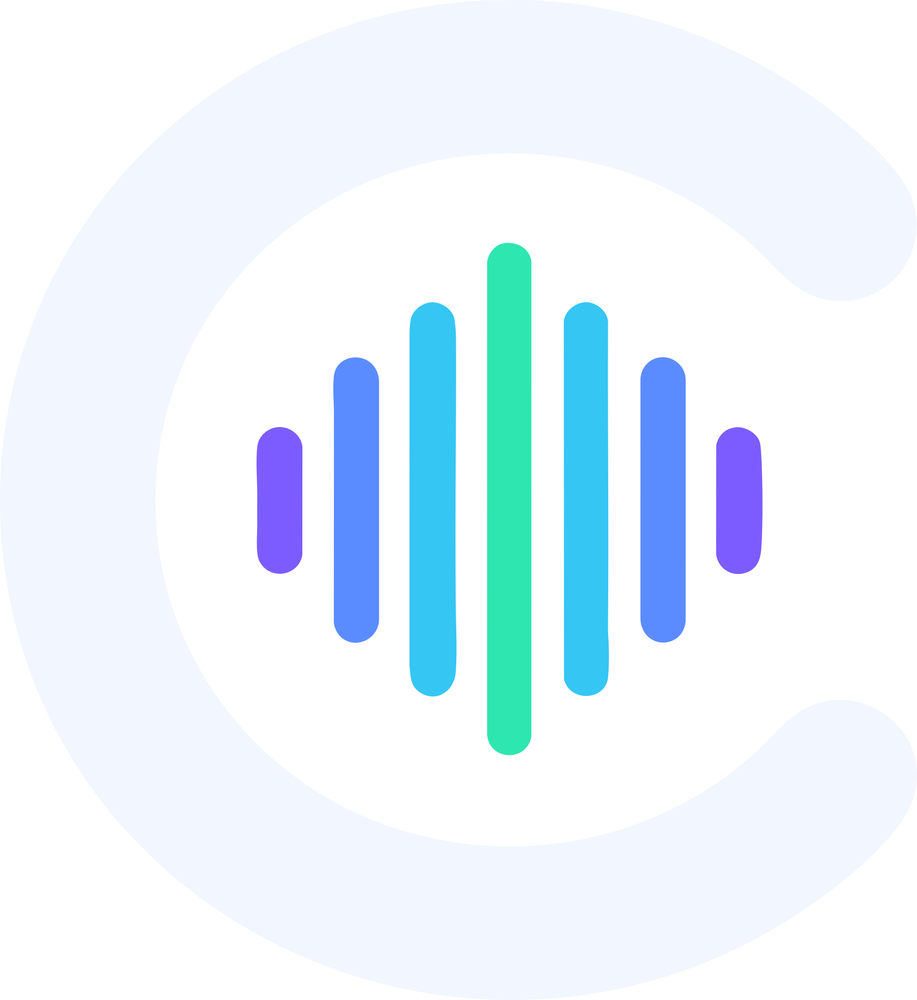

<div align="center">
  
</div>

# Cadence

A web app for pronunciation assessment, powered by the Azure AI Speech service.
It records you reading a passage in the language you are practicing, and scores
the take on accuracy, fluency, completeness and prosody, down to per-word,
per-syllable and per-phoneme detail.

- **Frontend**: Angular 22 + Angular Material (zoneless, signals), served by nginx
- **Backend**: FastAPI (async) streaming microphone PCM over **WebSockets** into the
  Azure Speech SDK
- Two assessment modes, selectable in the UI:
  - **Single utterance**: `recognize_once`, stops automatically after a pause
  - **Continuous**: keeps listening across pauses until you stop; miscues
    (omissions/insertions) and whole-passage scores are recomputed server-side
    following the [Azure sample algorithm](https://github.com/Azure-Samples/cognitive-services-speech-sdk/blob/master/scenarios/python/console/language-learning/pronunciation_assessment.py)
- Leaving the reference text empty runs an **unscripted** assessment
- **Model pronunciation**: pick a voice and hear the whole phrase (in the
  waveform player, so you can loop a fragment) or any single word from the
  results. Voices come from Azure, and optionally ElevenLabs, OpenAI or
  Gemini. Each provider appears only when it is configured.
- **Two speed controls**: *voice speed* re-synthesizes so the voice actually
  enunciates slower (Azure SSML prosody, OpenAI/ElevenLabs speed), while
  *playback speed* stretches existing audio without changing pitch, and is
  the only one that also slows down your own recording.

## Getting the keys

Only Azure is required. The other providers stay hidden in the UI until their
key is filled in, so you can add them later or not at all.

| Provider | Used for | Where |
| --- | --- | --- |
| **Azure AI Speech** (required) | The assessment itself, plus the default voices | [Create a Speech resource](https://portal.azure.com/#create/Microsoft.CognitiveServicesSpeechServices), then copy the key and region from *Keys and Endpoint* ([quickstart](https://learn.microsoft.com/azure/ai-services/speech-service/get-started-speech-to-text)) |
| ElevenLabs | Extra voices | [Developers → API Keys](https://elevenlabs.io/docs/api-reference/authentication) |
| OpenAI | Extra voices, translator | [platform.openai.com/api-keys](https://platform.openai.com/api-keys) |
| Google Gemini | Extra voices, translator | [aistudio.google.com/api-keys](https://aistudio.google.com/api-keys) |

The Azure free tier (F0) gives 5 audio hours a month, which is plenty to try it
out. The translator also runs against a local Ollama with no key at all, see
`TRANSLATOR_BASE_URL`.

## Configuration

Copy `.env.example` to `.env`:

| Variable | Description |
| --- | --- |
| `AZURE_SPEECH_KEY` | Azure Speech resource key (required) |
| `AZURE_SPEECH_ENDPOINT` | Resource endpoint, e.g. `https://<name>.cognitiveservices.azure.com` |
| `AZURE_SPEECH_REGION` | Region name (used when the endpoint is empty) |
| `TTS_AZURE_ENABLED` | Offer Azure voices for model pronunciation (default `true`) |
| `TTS_ALLOW_CUSTOM_VOICES` | Allow hand-entered voice ids outside a provider's catalog (default `false`) |
| `ELEVENLABS_API_KEY` / `OPENAI_API_KEY` / `GEMINI_API_KEY` | Extra voice providers; each shows up only when its key is non-empty |
| `ELEVENLABS_MODEL` / `OPENAI_TTS_MODEL` / `GEMINI_TTS_MODEL` | Model used by each provider |
| `TRANSLATOR_ENABLED` | Offer the "write in your own language" translator (default `true`) |
| `TRANSLATOR_PROVIDER` | `openai` (any chat-completions API: OpenAI, Gemini, OpenRouter, vLLM, Ollama) or `anthropic` |
| `TRANSLATOR_BASE_URL` / `TRANSLATOR_API_KEY` / `TRANSLATOR_MODEL` | Endpoint, key (omit for local servers) and model; an empty model hides the feature |
| `TRANSLATOR_PROMPT` | Instruction template; `<selected-language>` is replaced with the practiced language |
| `TRANSLATOR_PROMPT_EDITABLE` | Let users rewrite the prompt in the UI (default `false`) |
| `CORS_ORIGINS` | Comma-separated allowed origins; empty disables CORS headers (fine when nginx proxies same-origin, the default) |
| `CORS_ALLOW_CREDENTIALS` | `true`/`false` |
| `FRONTEND_PATH` | Serve the app under a secret prefix, e.g. `/project-2022-72245` (default `/`) |
| `API_PATH` | Serve the API under its own, independent prefix (default `/`) |
| `API_DOCS_ENABLED` | Expose the OpenAPI schema and Swagger UI (default `false`) |
| `CADENCE_PORT` | Host port for the frontend in production compose (default `8080`) |
| `CADENCE_VERSION` | Image tag for production compose (default `latest`) |

## Development (live reload)

```sh
docker compose -f docker-compose.dev.yml up --build
```

- Frontend: http://localhost:4200. `ng serve` with hot reload, proxying
  `/api` and `/ws` to the backend (see `frontend/proxy.conf.mjs`)
- Backend: http://localhost:8000. `uvicorn --reload` with the source bind-mounted

## Production

```sh
cp .env.example .env   # fill in the Azure credentials
docker compose up -d --build
```

nginx serves the compiled Angular app on `${CADENCE_PORT:-8080}` and proxies
`/api` and `/ws/assess` (websocket upgrade) to the FastAPI container, which is
not published to the host. The backend runs as a non-root user behind
`--proxy-headers`.

To use prebuilt images instead of building, drop `--build`; compose pulls
`ghcr.io/jfhack/cadence-{frontend,backend}`.

> The browser only allows microphone capture on `localhost` or HTTPS origins,
> so put a TLS reverse proxy in front for remote deployments.

### Sharing a docker network instead of publishing

If your reverse proxy runs in docker too, put cadence on its network and skip
the host binding altogether: set `CADENCE_NETWORK` to that network's name and
`CADENCE_NETWORK_EXTERNAL=true`, then add the overlays that drop the published
ports. Your proxy reaches `cadence-frontend:80` and `cadence-authelia:9091` by
name, and 8080 and 9091 stay free on the host.

```sh
scripts/stack.sh start --no-ports
```

`scripts/stack.sh` assembles the `-f` chain for you: `start`, `stop`,
`restart`, `status`, `logs` and `reset`, with `--caddy`, `--plain`,
`--no-ports` and `--build`. The equivalent by hand is:

```sh
docker compose -f docker-compose.yml \
               -f docker-compose.authelia.yml \
               -f docker-compose.no-ports.yml \
               -f docker-compose.authelia-no-ports.yml up -d
```

`stop` runs a plain `down`, so the Authelia database and the TLS certificates
survive. `reset` is the one that adds `-v`, and it asks for confirmation
first, because re-issuing certificates counts against Let's Encrypt rate
limits.


### Do not leave the port open past your proxy

Once something fronts the app, set `CADENCE_BIND=127.0.0.1` so the published
port is reachable only from the host itself. Otherwise `http://server:8080`
still serves the app and walks straight past whatever login you put in front.

Note that Docker publishes ports with its own iptables rules, which UFW does
not filter, so `ufw deny 8080` will **not** close it. Binding to loopback is the
reliable fix. The optional overlay below removes the published port entirely.

## Spending guard

Every recording, spoken phrase and translation bills someone upstream, so the
backend keeps a running estimate of the day's spend and refuses further paid
work once `DAILY_BUDGET_USD` (default 10) would be crossed. It resets at
midnight UTC; `GET /api/health` reports what is left.

Roughly what the default allows in a day, at the built-in rates:

| | |
| --- | --- |
| Recorded speech assessed | ~10 hours |
| Azure / OpenAI model pronunciation | ~600,000 characters |
| ElevenLabs model pronunciation | ~45,000 characters |
| Translation | ~5,000,000 characters |

Those rates are approximations of list pricing, exposed as
`COST_*` variables. Check them against your actual bills and adjust. The
guard is there to bound the damage from a stuck client or a leaked password
and give you time to notice, not to do accounting.

Counters are in memory, so they reset if the backend restarts. That is the
trade for not requiring a database; for a single-instance deployment it is
usually fine. nginx additionally rate-limits `/api` per client address
(`API_RATE_LIMIT`, `API_RATE_BURST`) to blunt bursts between budget checks.

## Authentication

Cadence has no built-in login: every request costs money at Azure and the
LLM providers, so put an authenticating proxy in front of it.

### Already running a reverse proxy?

Use `docker-compose.authelia.yml`, which adds Authelia alone and leaves the
proxying to you:

```sh
cp .env.example .env         # set CADENCE_DOMAIN and AUTH_DOMAIN
scripts/init-auth.sh         # generates secrets, creates the first user
docker compose -f docker-compose.yml -f docker-compose.authelia.yml up -d
```

Authelia listens on `127.0.0.1:9091` and the app on `127.0.0.1:8080` (set
`CADENCE_BIND=127.0.0.1`), so your proxy can reach both and the network
cannot. Two site blocks, one for the app and one for the login portal:

```caddyfile
cadence.example.com {
    forward_auth 127.0.0.1:9091 {
        uri /api/authz/forward-auth
        copy_headers Remote-User Remote-Groups Remote-Name Remote-Email
    }
    reverse_proxy 127.0.0.1:8080
}

auth.cadence.example.com {
    reverse_proxy 127.0.0.1:9091
}
```

`reverse_proxy` passes websocket upgrades through unchanged, so the recording
socket keeps working. The nginx equivalent of `forward_auth` is
`auth_request`; Traefik uses a `forwardAuth` middleware.

### Starting from nothing

`docker-compose.caddy.yml` layers Caddy (TLS, automatic certificates) and
Authelia (login portal, file-based users, TOTP available) over the base stack.
It also unpublishes the app entirely, so the only way in is through the login.

```sh
cp .env.example .env         # set CADENCE_DOMAIN and AUTH_DOMAIN
scripts/init-auth.sh         # generates secrets, creates the first user
docker compose -f docker-compose.yml -f docker-compose.caddy.yml up -d
```

`AUTH_DOMAIN` must be a subdomain of `CADENCE_DOMAIN` (for example
`cadence.example.com` and `auth.cadence.example.com`) so a single session
cookie covers both and nothing else on the server ever sees it. Point both
names at the host in DNS; Caddy obtains the certificates itself.

Both overlays keep their state in named Docker volumes. To use directories
instead, so you can back them up with ordinary tools, set
`CADENCE_AUTHELIA_DATA`, `CADENCE_CADDY_DATA` and `CADENCE_CADDY_CONFIG` to
paths in `.env`. Named volumes are the default because Authelia keeps a
SQLite database, and bind mounts on Docker Desktop can hit file-locking and
ownership problems that do not occur on Linux.

Add more people by re-running `scripts/init-auth.sh`. To require a second
factor, change the rule in `deploy/authelia/configuration.yml` from
`one_factor` to `two_factor`; users then enrol an authenticator on first
login.

## Building / publishing images

```sh
scripts/build-images.sh            # local build, tags :latest
scripts/build-images.sh v1.2.3     # tags :v1.2.3 + :latest
PUSH=1 scripts/build-images.sh v1.2.3
```

Pushing a `v*` tag to GitHub triggers `.github/workflows/publish.yml`, which
builds and publishes both images to GHCR for `linux/amd64` and `linux/arm64`.

## How it works

1. The browser captures the microphone with an `AudioWorklet`, resamples to
   16 kHz mono 16-bit PCM and streams ~200 ms binary chunks over a websocket
   (`/ws/assess`).
2. FastAPI feeds the chunks into an Azure `PushAudioInputStream`; a
   `SpeechRecognizer` with a `PronunciationAssessmentConfig` runs either
   `recognize_once` (single) or continuous recognition.
3. Partial hypotheses (`recognizing`), per-phrase scores (`phrase`) and the
   final assessment (`summary`) stream back as JSON over the same websocket.

## License

[MIT](LICENSE)

That covers this project's own source. Bundled dependencies keep their own
terms: most are MIT or Apache-2.0 (Angular, Angular Material, FastAPI, Caddy,
Authelia), but the **Azure Speech SDK is distributed under Microsoft's licence
rather than an open-source one**, and it ships inside the backend image.
